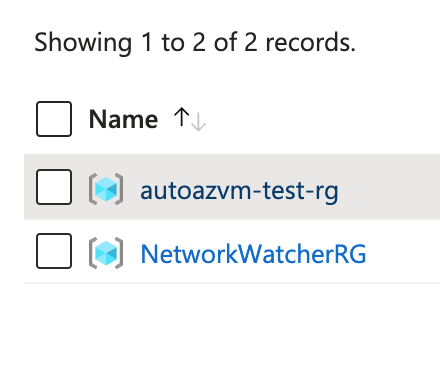

## Terraform Azure Virtual Machine Automation

Provision a Virtual Machine and its related resources on the Azure platform using Terraform as your Infrastructure-as-Code (IaC) tool.

### Architecture


### CI/CD Workflows

- **terraform.yml**: Automates CI/CD pipeline—runs `terraform init`, `validate`, `plan`, and `apply` to provision resources based on `main.tf`.

### Multi-Environment Support

- **terraform.tfvars** enables deploying across multiple environments (e.g., dev, test, prod).

### Backend State Management

- **backend.tf**: Configures remote state storage by creating a new Resource Group, ensuring:
  - Secure state storage off local runners
  - Safe collaboration with state locking
  - Versioning of infrastructure changes

> [!IMPORTANT]
> **Note:** Run `backend.ps1` before initializing Terraform to provision backend storage resources.

### SSH Access to VM

Retrieve your VM’s (Ubuntu) public IP:
```sh
az vm list-ip-addresses --resource-group <RESOURCE_GROUP_NAME> --name <VM_NAME> --query "[].virtualMachine.network.publicIpAddresses[0].ipAddress" --output tsv
```

Connect via SSH:
```bash
ssh <username>@<IP_ADDRESS>
```

### Generating a Graph

#### Prerequisite

Install `Graphviz` locally via Homebrew:

```bash
brew install graphviz
dot -V # verify it by running
```
#### Generate a Terraform Plan Graph (Advanced):

- In your terminal, navigate to the directory containing your Terraform configuration files. 
- Run `terraform init` to initialize the configuration.
- Run `terraform plan -out=plan.out` to create a plan. 
- Run `terraform graph -plan=plan.out | dot -Tsvg > graph.svg` to generate an SVG file of your Terraform plan.

#### View the Generated Graph:

Open the `graph.svg` file in Visual Studio Code to view the visual representation of your Terraform resources and their dependencies.

## Key Learnings

These are insights and resolutions gathered during the development of this Terraform-based Azure VM automation project:

- **`network_interface_name`**  
  Referencing a map (`{}`) directly caused issues; resolved by extracting the value into a separate variable.

- **`network_interface_ids`**  
  Required a `list(string)` format. Ensured correct passing by inserting as an array `[]`.

- **`azurerm_virtual_network` Dependency**  
  The virtual network was prematurely initialized before the resource group. Added a `depends_on` clause to enforce creation order and avoid failures.

- **Automatic Creation of `NetworkWatcherRG`**  
  Azure auto-generates a resource group named `NetworkWatcherRG` after deploying networking components like VNET, SUBNET, and NI. This group is part of Azure's free network monitoring and can be manually deleted or disabled per region if desired.
  

### Acknowledgements
- [Terraform Documentation](https://www.terraform.io/docs/providers/azurerm/)
- [Azure Documentation](https://docs.microsoft.com/en-us/azure/)
- **PowerShell**: PowerShell file used to centralize terraform commands related to this project.
- **GitHub**: Platform for version control and collaboration.
- `backend.ps1` - Reference: [Microsoft Reactor Series](https://developer.microsoft.com/en-us/reactor/series/S-1162/)

## Contributing

Contributions are **welcome**! Feel free to `fork` this repository and submit a `pull request (PR)`.

- For major changes, **please open an issue first** to discuss your ideas and ensure alignment.
- There’s an open [discussion thread](https://github.com/RScrafted/terraform-azure-vm-automation/discussions) where everyone can share improvements, feedback, and use cases. Jump in!

> 💡 Whether it's refactoring code, improving documentation, or sharing deployment tips—every contribution helps!