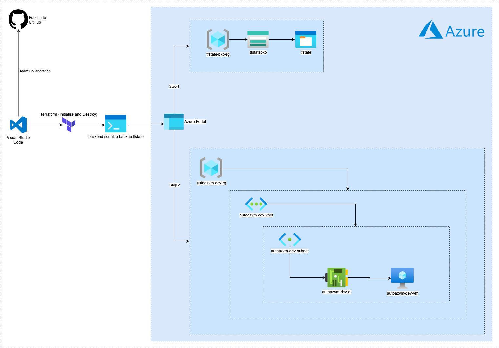

## Terraform Azure Virtual Machine Automation

---

Provisioning Virtual Machine and related resources in Azure Platform using Terraform as IaC tool to deploy it.

- The `terraform.yml` automates Continuous Integration (CI) executing terraform initialize, validate, plan, and performs Continuous Dilivery (CD) that executes terraform apply to provision resources as stated in `main.tf`.

- The `workflow_dispatch.yml` allows manual trigger towards deprovisioning of the resources for cost effectiveness.

- The `terraform.tfvars` allows setup for multiple environments.

- The `backend.tf` configuration creates new Resource Group to avoid saving on runner's machine, enhancing security and effective team collaboration.

> [!IMPORTANT]
> **Note:** It is important to Create TFState Backup Resource Group by running `backend.ps1` Prior to allow Terraform to initialize backend configuration.

### Connecting new VM using ssh

Identifying new vm (ubuntu's) IP:

```sh
az vm list-ip-addresses --resource-group <RESOURCE_GROUP_NAME> --name <VM_NAME> --query "[].virtualMachine.network.publicIpAddresses[0].ipAddress" --output tsv
```

Just replace <RESOURCE_GROUP_NAME> with the name of your resource group and <VM_NAME> with the name of your VM. This command will return the public IP address of your VM.


```bash
ssh username@20.20.10.xxx
```

---

## Architecture



---

## Generating a Graph
### Prerequisite
Install `Graphviz` locally via Homebrew:

```bash
brew install graphviz
dot -V # verify it by running
```
### Generate a Terraform Plan Graph (Advanced):

- In your terminal, navigate to the directory containing your Terraform configuration files. 
- Run `terraform init` to initialize the configuration.
- Run `terraform plan -out=plan.out` to create a plan. 
- Run `terraform graph -plan=plan.out | dot -Tsvg > graph.svg` to generate an SVG file of your Terraform plan.

#### View the Generated Graph:

Open the `graph.svg` file in Visual Studio Code to view the visual representation of your Terraform resources and their dependencies.

---

### Key Learnings

Please visit the [WIKI](https://github.com/RScrafted/terraform-azure-vm-automation/wiki) page.

---

### Acknowledgements
- [Terraform Documentation](https://www.terraform.io/docs/providers/azurerm/)
- [Azure Documentation](https://docs.microsoft.com/en-us/azure/)
- **PowerShell**: PowerShell file used to centralize terraform commands related to this project.
- **GitHub**: Platform for version control and collaboration.
- `backend.ps1` - Reference: [Microsoft Reactor Series](https://developer.microsoft.com/en-us/reactor/series/S-1162/)

---